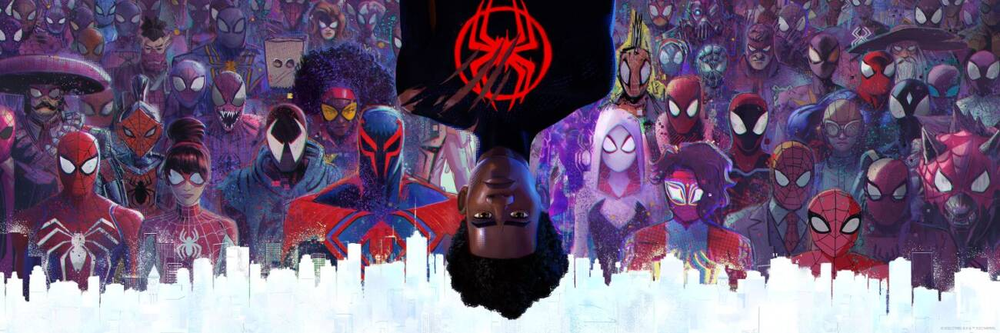

  

# 🕸️ Spiderverse 🕷️

Sente-se, pegue uma pipoca e seja bem-vindo(a) ao **Spiderverse**! Essa landing page foi criada para ser uma homenagem a meu filme favorito.🌟  Utilizando React, SCSS, JavaScrpit e Gulp, foi possível criar uma landing page interativa baseada nos sites de streamings.! ✨

## 💻 Tecnologias Utilizadas

Este projeto foi construído com uma teia de tecnologias poderosas, garantindo performance e uma ótima experiência de desenvolvimento:

* **HTML:** A estrutura fundamental das nossas páginas web. 🧱
* **SCSS (Sass):** Estilos super-heróicos, organizados e eficientes, com o poder de variáveis, mixins e aninhamento. 🎨
* **JavaScript:** A inteligência por trás da interatividade e das funcionalidades dinâmicas do projeto. ⚡
* **Gulp.js:** Nosso parceiro fiel na automação de tarefas, cuidando da compilação de SCSS, minificação de código e muito mais! 🛠️

